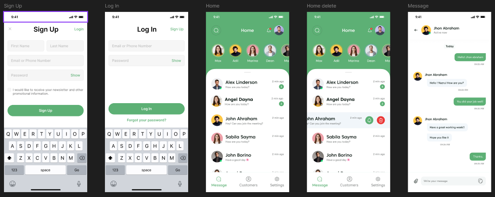

# 🛡️ Safe Chat App



**Safe Chat** is a privacy-focused real-time chat application built with **FastAPI (backend)** and **Kotlin (Android client)**.  
It ensures secure communication between users by validating Wi-Fi network safety, encrypting messages, and providing a clean, modern chat experience.

---

## 🚀 Features

### 🧩 Core Features
- **User Authentication**
  - Register, login, and token-based authentication (JWT)
- **Real-time Messaging**
  - WebSocket-based chat for instant delivery
- **Unread Message Tracking**
  - Each chatroom shows the number of unread messages
- **Last Message Preview**
  - Chat list shows the most recent message for each chatroom
- **Message Read Status**
  - Messages automatically marked as read when viewed

### 🔒 Safety Features
- **End-to-End Encryption (Planned)**
  - Ensures message confidentiality and privacy

### 💬 Chatroom Management
- Create and manage 1-on-1 chatrooms  
- See last message and unread count  
- Receive live notifications for new messages

---

## 🧠 Tech Stack

### Backend (FastAPI)
- **Framework:** FastAPI  
- **Database:** PostgreSQL + SQLAlchemy ORM  
- **Auth:** JWT-based authentication  
- **WebSocket:** Real-time chat system  
- **Serializer:** Pydantic models  
- **Deployment:** Uvicorn / Gunicorn  

### Android App (Kotlin)
- **Architecture:** MVVM + Flow + Jetpack Compose  
- **Networking:** Retrofit + OkHttp  
- **WebSocket:** OkHttp WebSocket client  
- **Persistence:** Room Database  
- **UI:** Material 3 + Compose UI  
- **Coroutines:** For async event handling  

---

## 📡 API Overview

| Endpoint | Method | Description |
|-----------|--------|-------------|
| `/api/v1/auth/register` | POST | Register a new user |
| `/api/v1/auth/login` | POST | Login and get JWT token |
| `/api/v1/chatrooms` | GET | Get all chatrooms for the logged-in user |
| `/api/v1/chatrooms/{id}/messages` | GET | Fetch all messages from a room |
| `/api/v1/chatrooms/{id}/messages` | POST | Send a message to a room |
| `/ws/chat/{room_id}` | WS | Connect to WebSocket for real-time messaging |

---

## ⚙️ Setup Guide

### Backend Setup

1. Clone the repository:
   ```bash
   git clone https://github.com/yourusername/safe-chat.git
   cd safe-chat
